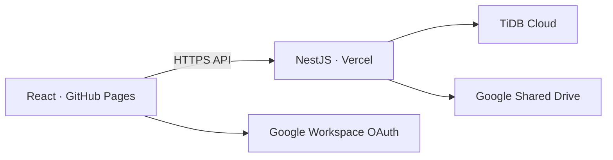

# PSUWIT Digital Governance System

ระบบบริหารการกำกับดูแลปัญญาประดิษฐ์ ข้อมูล ระบบดิจิทัล และความมั่นคงปลอดภัยไซเบอร์ สำหรับโรงเรียน มอ.วิทยานุสรณ์ พัฒนาตามสถาปัตยกรรม React บน GitHub Pages, NestJS บน Vercel, TiDB Cloud, Google Shared Drive และ Google Workspace OAuth

## ขอบเขตชุดงาน

| ชุดงาน | ความสามารถที่ส่งมอบ |
|---|---|
| 1. ผู้ใช้งานและโครงสร้างบริหาร | Google Workspace Login, จำกัดโดเมน, บทบาทและสิทธิ์, ค่าควบคุมส่วนกลาง |
| 2. คำขอและการพิจารณา | รับคำขอ AI/ข้อมูล/ระบบ/Cloud, ประเมินความเสี่ยงอัตโนมัติ, ความเห็น, อนุมัติ/ขอแก้ไข/ไม่อนุมัติ, ประวัติรายการ |
| 3. ทะเบียนกลาง | เครื่องมือ AI, ระบบ, ชุดข้อมูล, ผู้ให้บริการ, API และบัญชีผู้ดูแล พร้อมวันทบทวน |
| 4. ความเสี่ยงและเหตุการณ์ | ทะเบียนความเสี่ยง 5×5, มาตรการควบคุม, รับแจ้งเหตุ, ระดับความรุนแรง และการตอบสนอง |
| 5. รายงานและหลักฐาน | Dashboard, CSV, Audit Log, เชื่อมโยงหลักฐานใน Shared Drive และตั้งค่าระบบ |



ไม่มีการใช้กระบวนการ PSUWIT.AGENT Gate 0–7 ในระบบนี้

## ทดลองบนเครื่อง

ต้องมี Node.js 22 ขึ้นไป

```bash
npm install
cp backend/.env.example backend/.env
cp frontend/.env.example frontend/.env
```

กำหนด `DEMO_MODE=true` ใน `backend/.env` และ `VITE_DEMO_MODE=true` ใน `frontend/.env` แล้วเปิดสองหน้าต่างคำสั่ง

```bash
npm run dev:backend
npm run dev:frontend
```

เปิด `http://localhost:5173` แล้วเลือก “เข้าใช้ระบบสาธิต” ข้อมูลสาธิตเก็บในหน่วยความจำและจะถูกล้างเมื่อ Backend เริ่มใหม่

## เอกสารประกอบ

- [คู่มือติดตั้งและตั้งค่า](docs/INSTALLATION_TH.md)
- [คู่มือบริหารระบบถาวร](docs/OPERATIONS_TH.md)
- [รายการตรวจรับระบบ](docs/UAT_CHECKLIST_TH.md)
- [รายการ API](docs/API_TH.md)

## คำสั่งตรวจสอบ

```bash
npm run build
npm test
```

ระบบนี้เป็นฐานพร้อมใช้งานและต่อยอดได้ การนำขึ้นใช้งานจริงต้องกำหนดบัญชีบริการ รหัสลับ ฐานข้อมูล และสิทธิ์ Shared Drive ตามคู่มือติดตั้ง โดยห้าม commit ไฟล์ `.env` หรือ Service Account JSON ลง GitHub
